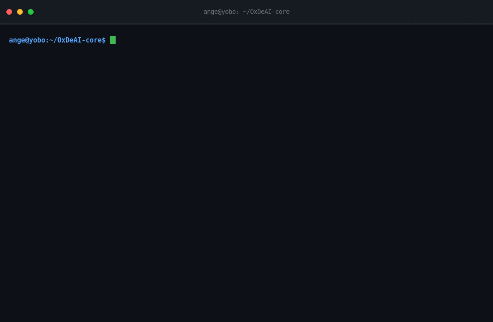
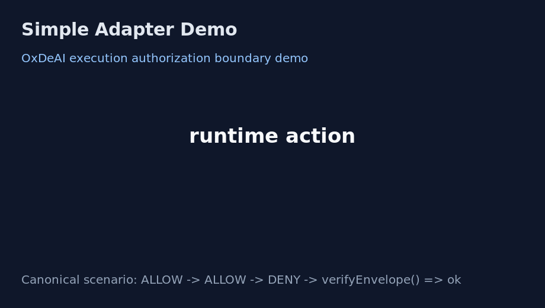
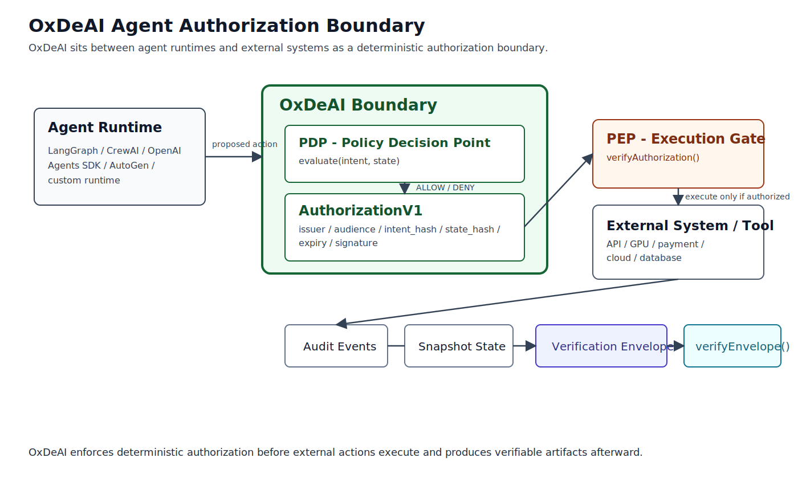

# OxDeAI-core

Deterministic execution authorization protocol for autonomous systems.

OxDeAI-core hosts OxDeAI protocol specifications and the TypeScript reference stack.

OxDeAI enforces economic and operational constraints before an agent executes an external action, with deterministic policy evaluation, cryptographic authorization, and tamper-evident audit evidence.

## Demo



This is the canonical cross-adapter validation scenario.

Expected deterministic result:

- `ALLOW`
- `ALLOW`
- `DENY`

Verification result:

- `verifyEnvelope() => ok`

This demo shows the OxDeAI deterministic authorization boundary enforcing policy decisions before agent actions execute.

## Why OxDeAI Exists

Most AI guardrail systems focus on prompts or model outputs. OxDeAI focuses on the execution authorization boundary.

Agent runtimes can trigger:

- API calls
- infrastructure provisioning
- payments
- external tool execution

The critical security question is deterministic:

> Is this action allowed to execute under the current economic policy state?

Instead of monitoring behavior after execution, OxDeAI enforces pre-execution authorization. The engine evaluates `(intent, state)` and emits a cryptographically verifiable authorization artifact before any external action occurs.

## Current Milestone

- `v1.1` Authorization Artifact: complete
- `v1.2` Non-Forgeable Verification: complete
- `v1.3` Guard Adapter + Integration Surface: complete
- `v1.4` Ecosystem Adoption: complete
- Next: `v1.5` developer experience

Planned phases (`v2.x` Delegated Agent Authorization, `v3.x` Verifiable Execution Infrastructure) are tracked in [`ROADMAP.md`](./ROADMAP.md).

## Version Snapshot

Protocol stack:
- `@oxdeai/core`: `1.3.0`
- `@oxdeai/sdk`: `1.3.1`
- `@oxdeai/conformance`: `1.3.1`

Tooling:
- `@oxdeai/cli`: `0.2.2` (independent tooling line)

## Core Principles

- Deterministic evaluation
- Fail-closed semantics
- Explicit invariants
- Cryptographic authorization
- AuthorizationV1 pre-execution gating
- Non-forgeable verification (Ed25519 + keyset)
- Hash-chained audit logs
- Stateless verifiability (snapshot/audit/envelope)
- Property testing (fuzz + meta-property)

## Repo Layout

Protocol packages:
- `packages/core` - protocol reference implementation
- `packages/sdk` - integration SDK surface (guard adapter + client helpers)
- `packages/conformance` - frozen vectors and compatibility validator

Tooling package:
- `packages/cli` - protocol-oriented local tooling (`build`, `verify`, `replay`)

Examples:
- `examples/openai-tools` - protocol reference boundary demo
- `examples/langgraph` - framework integration boundary demo
- `examples/crewai` - CrewAI-shaped boundary integration demo
- `examples/openai-agents-sdk` - OpenAI Agents SDK-shaped boundary integration demo
- `examples/autogen` - AutoGen-shaped boundary integration demo
- `examples/openclaw` - OpenClaw-shaped boundary integration demo

Specifications and docs:
- `SPEC.md`, `SECURITY.md`, `PROTOCOL.md`
- architecture explainer: [`docs/architecture/why-oxdeai.md`](./docs/architecture/why-oxdeai.md)
- integrations index: [`docs/integrations/README.md`](./docs/integrations/README.md)
- production integration guide: [`docs/pep-production-guide.md`](./docs/pep-production-guide.md)
- adapter integration model: [`docs/adapter-reference-architecture.md`](./docs/adapter-reference-architecture.md)
- diagram workflow: [`docs/diagrams/README.md`](./docs/diagrams/README.md)
- media demos: [`docs/media/README.md`](./docs/media/README.md)
- contributor guide: [`CONTRIBUTING.md`](./CONTRIBUTING.md)

## Examples

- [`examples/openai-tools`](./examples/openai-tools) - protocol reference demo
  - canonical PDP/PEP boundary flow
  - deterministic intent -> decision -> authorization -> audit -> envelope verification

- [`examples/langgraph`](./examples/langgraph) - framework integration demo
  - same boundary model embedded in a LangGraph workflow
  - frameworks propose actions; OxDeAI authorizes execution

- [`examples/crewai`](./examples/crewai) - CrewAI-shaped integration demo
  - same deterministic economic policy scenario
  - same PDP/PEP enforcement and envelope verification path

- [`examples/openai-agents-sdk`](./examples/openai-agents-sdk) - OpenAI Agents SDK-shaped integration demo
  - same deterministic economic policy scenario
  - same PDP/PEP enforcement and envelope verification path

- [`examples/autogen`](./examples/autogen) - AutoGen-shaped integration demo
  - same deterministic economic policy scenario
  - same PDP/PEP enforcement and envelope verification path

- [`examples/openclaw`](./examples/openclaw) - OpenClaw-shaped integration demo
  - same deterministic economic policy scenario
  - same PDP/PEP enforcement and envelope verification path

## Integrations

- [OpenAI tools integration](./docs/integrations/openai-tools.md)
- [OpenAI Agents SDK integration](./docs/integrations/openai-agents-sdk.md)
- [LangGraph integration](./docs/integrations/langgraph.md)
- [CrewAI integration](./docs/integrations/crewai.md)
- [AutoGen integration](./docs/integrations/autogen.md)
- [OpenClaw integration](./docs/integrations/openclaw.md)

## Cross-Adapter Demo Scenario

All maintained adapters implement the same reproducible authorization scenario:

- `ALLOW`
- `ALLOW`
- `DENY`
- `verifyEnvelope() => ok`

Reference:
- [Shared demo scenario](./docs/integrations/shared-demo-scenario.md)

## Adapter Validation

Maintained adapters are validated for:

- deterministic scenario behavior
- authorization boundary enforcement

Reference:
- [Adapter validation](./docs/integrations/adapter-validation.md)
- [Adoption checklist](./docs/integrations/adoption-checklist.md)

## Quick Demo



Run one maintained adapter demo from the repository root:

```bash
pnpm -C examples/openai-tools start
```

Expected semantic result:

- `ALLOW`
- `ALLOW`
- `DENY`
- `verifyEnvelope() => ok`

This is the execution authorization boundary in action: two proposed actions are authorized, the third is refused before side effects, and the resulting evidence verifies offline.

## Case Studies

- [API cost containment](./docs/cases/api-cost-containment.md)
- [Infrastructure provisioning control](./docs/cases/infrastructure-provisioning-control.md)

## Stack Placement

`framework/runtime -> OxDeAI authorization boundary -> tool execution`

- Framework/runtime proposes actions.
- OxDeAI PDP evaluates intent and emits authorization on `ALLOW`.
- PEP verifies authorization and either executes or refuses.

## Architecture Overview

OxDeAI sits between agent runtimes and external systems as a deterministic authorization boundary.



- `Agent Runtime`: proposes actions with intent and state context.
- `OxDeAI PDP`: evaluates `intent,state` and emits `AuthorizationV1` only on `ALLOW`.
- `PEP gate`: `verifyAuthorization` must pass before any side effect.
- `Tool / External System`: executes only after authorization enforcement.
- `Evidence path`: audit events + snapshot are packaged as a verification envelope and validated by `verifyEnvelope()`.

## Ecosystem Positioning

Agent safety stacks are emerging in three layers:

1. Prompt and output guardrails
2. Runtime monitoring and observability
3. Execution authorization

OxDeAI operates at layer 3. It provides a deterministic authorization boundary for agent actions before external effects occur.

## Multi-Language Use

Rust, Go, and Python developers can verify OxDeAI artifacts today (`AuthorizationV1`, snapshots, audit chains, and verification envelopes).

TypeScript is the current reference implementation.
Native implementations are supported by the protocol spec and conformance vectors:

- [`docs/multi-language.md`](./docs/multi-language.md)
- [`docs/conformance-vectors.md`](./docs/conformance-vectors.md)
- [`packages/conformance`](./packages/conformance)

## Quickstart

## Requirements

- Node.js >= 20
- pnpm >= 9

Clone:

```bash
git clone https://github.com/AngeYobo/oxdeai-core.git
cd oxdeai-core
```

Install `pnpm`:

```bash
corepack enable
corepack prepare pnpm@9.12.2 --activate
```

Install dependencies:

```bash
pnpm install
```

Build the workspace:

```bash
pnpm build
```

Run demo:

```bash
pnpm -C examples/openai-tools start
```

Expected output:

- `ALLOW`
- `ALLOW`
- `DENY`
- `verifyEnvelope() => ok`

What you are seeing:
- the runtime proposes three actions
- OxDeAI authorizes two and refuses the third before execution
- the resulting snapshot, audit evidence, and verification envelope stay consistent

## Release

- [Release checklist](./docs/release-checklist.md)
- [Release policy](./RELEASE.md)

## Protocol Stack Release v1.3.x

This line completes the v1.3 integration surface on top of the v1.2 non-forgeable verification baseline.

The OxDeAI protocol stack now provides:

- cryptographically verifiable authorization artifacts
- deterministic policy evaluation
- tamper-evident audit chains
- stateless verification envelopes
- stable SDK guard adapter integration surface
- reference OpenAI tools and LangGraph boundary demos

The protocol is validated through the OxDeAI conformance suite.

## Validation Snapshot

Latest local validation (2026-03-08):

- `pnpm build` pass
- `pnpm -C packages/conformance validate` pass (94 assertions)
- `pnpm -r test` pass
- `pnpm -C examples/openai-tools start` pass (`ALLOW`, `ALLOW`, `DENY`, envelope `ok`)
- `pnpm -C examples/langgraph start` pass (`ALLOW`, `ALLOW`, `DENY`, envelope `ok`)
- `pnpm -C examples/crewai start` pass (`ALLOW`, `ALLOW`, `DENY`, envelope `ok`)
- `pnpm -C examples/openai-agents-sdk start` pass (`ALLOW`, `ALLOW`, `DENY`, envelope `ok`)
- `pnpm -C examples/autogen start` pass (`ALLOW`, `ALLOW`, `DENY`, envelope `ok`)
- `pnpm -C examples/openclaw start` pass (`ALLOW`, `ALLOW`, `DENY`, envelope `ok`)

## Benchmarking

OxDeAI includes a reproducible benchmark suite for measuring authorization latency and overhead.

The benchmark evaluates:

- policy evaluation (`evaluate`)
- envelope verification (`verifyEnvelope`)
- baseline vs protected execution paths

In the latest full-suite local run (`bench/outputs/run-2026-03-11-12-25-55.json`), the protected execution path added approximately:

- `+14.8 us p50` and `+21.8 us mean` in `best-effort` mode
- `+16.6 us p50` and `+25.2 us mean` in `strict` mode

on a single worker versus `baselinePath` on the tested machine.

These measurements depend on:

- hardware
- runtime
- workload

`verifyAuthorization` is also benchmarked in the suite, but it is treated as a secondary diagnostic signal because its runtime is often near the noise floor on modern CPUs.

The benchmark emphasizes incremental authorization cost:

`protectedPath - baselinePath`

This highlights bounded inline overhead rather than isolated microbenchmarks.

The benchmark suite is designed to provide transparent and reproducible measurements rather than fixed performance guarantees.

For this machine and runtime, the practical takeaway is that OxDeAI adds tens of microseconds of inline latency while introducing a deterministic authorization boundary for agent actions.

Full benchmark methodology and reproducible benchmark instructions are documented in [`bench/README.md`](./bench/README.md). A run-specific write-up is available in [`bench/BENCHMARK_SUMMARY.md`](./bench/BENCHMARK_SUMMARY.md), and a developer-facing benchmark announcement is available in [`docs/benchmark-announcement.md`](./docs/benchmark-announcement.md).

## Protocol Flow (v1.3.x)

- OxDeAI issues `AuthorizationV1` artifacts on `ALLOW`.
- External relying parties verify `AuthorizationV1` before execution.
- Verification envelopes remain post-execution proof artifacts.
