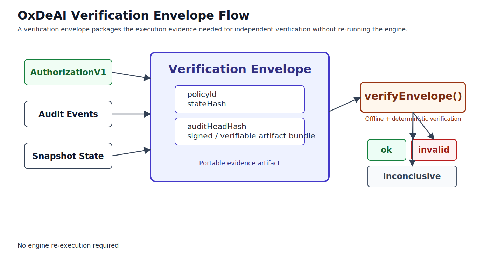

# @oxdeai/conformance

Conformance vectors and validator for the OxDeAI protocol.

## Purpose
`@oxdeai/conformance` verifies that an implementation matches the frozen protocol behavior for a specific version.

Passing validation means the implementation reproduces expected deterministic artifacts (hashes, statuses, and verification outputs) from frozen vectors.

## Version Coupling
- `@oxdeai/conformance@1.3.x` targets protocol/core `1.3.x` behavior.
- Use matching major/minor protocol versions when validating.

## Included Vector Sets
- `intent-hash.json`
- `authorization-payload.json`
- `snapshot-hash.json`
- `audit-chain.json`
- `audit-verification.json`
- `envelope-verification.json`
- `authorization-verification.json`
- `authorization-signature-verification.json`
- `envelope-signature-verification.json`

Current validator assertion count: `94`.

## Usage
From repo root:

```bash
pnpm -C packages/conformance extract
pnpm -C packages/conformance validate
```

Expected success output includes:

```text
Conformance passed: 94 assertions
```

## Adapter Contract
The validator is built around a pluggable adapter (`ConformanceAdapter`) so non-TypeScript runtimes can be checked against the same vectors.

An adapter must provide deterministic implementations for:
- canonical serialization used by vectors
- intent hashing
- authorization generation checks
- snapshot encoding + snapshot verification
- envelope verification

Reference adapter: `@oxdeai/core` (implemented in `src/validate.ts`).

## Verification Artifact Scope



Conformance checks deterministic behavior for artifacts and verifiers used in this flow (snapshot, audit, authorization, envelope, and verification status outputs).

Diagram source/editing policy:
- [`docs/diagrams/README.md`](../../docs/diagrams/README.md)

## Freeze Policy
Vectors are frozen per protocol version.

- Do not regenerate vectors for the same protocol version after behavior changes.
- Any behavior-impacting change requires a new protocol/versioned vector release.
- Regeneration is allowed only when intentionally producing a new version baseline.
