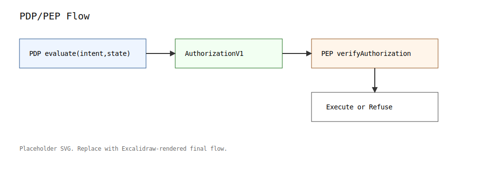

# @oxdeai/sdk

Developer-facing integration layer on top of `@oxdeai/core`.

## Status

Current protocol stack line: **v1.3.x** (`@oxdeai/core`, `@oxdeai/sdk`, `@oxdeai/conformance`).

The SDK is an integration surface and does not redefine protocol semantics.

## What It Adds

- Intent/state builder helpers
- Typed client wrapper for common flow: evaluate + persist + verify
- Public guard API for callback-boundary enforcement (`createGuard`)
- Runtime adapters (in-memory and file-based)

## Architecture Overview



OxDeAI SDK sits at the runtime integration boundary:

- runtime/adapter proposes action input
- PDP evaluates policy and emits `AuthorizationV1` on `ALLOW`
- PEP callback gate executes only after authorization enforcement

Diagram source/editing policy:
- [`docs/diagrams/README.md`](../../docs/diagrams/README.md)

## Guard API (v1.3 adoption layer)

The SDK exposes a framework-agnostic guard boundary:

```ts
const guard = createGuard({ engine, stateAdapter, auditAdapter, clock });
const result = await guard(intent, async ({ authorization }) => {
  return executeTool(authorization);
});
```

The callback runs only when OxDeAI returns `ALLOW` and authorization enforcement passes.
On `DENY` (or failed auth verification), the callback is not executed.

This keeps PDP/PEP separation explicit:

- PDP: `PolicyEngine.evaluatePure(...)` decides
- PEP: guard callback boundary enforces execute-or-refuse

OxDeAI sits below agent frameworks (OpenAI tools, LangGraph, others) as the deterministic authorization boundary.

## Quick Example

```ts
import { PolicyEngine } from "@oxdeai/core";
import {
  OxDeAIClient,
  createGuard,
  buildState,
  buildIntent,
  InMemoryStateAdapter,
  InMemoryAuditAdapter
} from "@oxdeai/sdk";

const engine = new PolicyEngine({
  policy_version: "v1",
  engine_secret: "dev-secret",
  authorization_ttl_seconds: 120
});

const stateAdapter = new InMemoryStateAdapter(
  buildState({
    policy_version: "v1",
    agent_id: "agent-1",
    allow_action_types: ["PROVISION"],
    allow_targets: ["us-east-1"]
  })
);

const auditAdapter = new InMemoryAuditAdapter();

const client = new OxDeAIClient({
  engine,
  stateAdapter,
  auditAdapter,
  clock: { now: () => 1770000000 }
});

const intent = buildIntent({
  intent_id: "intent-1",
  agent_id: "agent-1",
  action_type: "PROVISION",
  amount: 320n,
  target: "us-east-1",
  nonce: 1n
});

const result = await client.evaluateAndCommit(intent);

const guard = createGuard({
  engine,
  stateAdapter,
  auditAdapter,
  clock: { now: () => 1770000000 }
});

await guard(intent, async () => {
  // execute side effect only when ALLOW + auth checks pass
  return { ok: true };
});
```

## Main Exports

- `buildIntent`, `buildState`
- `OxDeAIClient`
- `InMemoryStateAdapter`, `InMemoryAuditAdapter`
- `JsonFileStateAdapter`, `NdjsonFileAuditAdapter`

## Scripts

```bash
pnpm -C packages/sdk build
pnpm -C packages/sdk test
```
